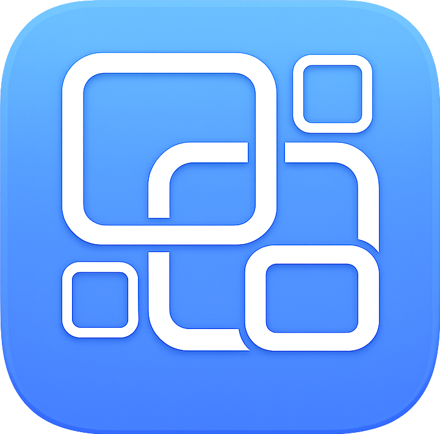

# wewi 🌐




**wewi** is a native macOS app that pins live web pages to your desktop as widgets.

Use it for dashboards, charts, docs, notes, and any URL you want to keep visible while working.

## ✨ Features

- Pin any URL as a desktop widget (`WKWebView`)
- Multiple widgets at once
- Widgets visible across Spaces
- Move and resize widgets directly on desktop
- Resize handle with concentric-circle indicator (hover to show, auto-hide delay)
- Widget body background fill behind web content (prevents transparent gaps on overscroll)
- System appearance sync signal to widget pages (`data-wewi-color-scheme` + change event)
- Per-widget settings:
  - Name, URL, position, size
  - Opacity
  - Enable/disable
  - Screen Lock mode (blocks web interaction)
- Widget top bar actions:
  - Reload
  - Screen Lock toggle (`ON` = blocked, `OFF` = interactive)
  - Disable widget
- Menu bar controls:
  - Open Settings
  - Enable/disable, reload, delete widgets
- Auto-save widget settings (`UserDefaults` JSON)
- Launch at login toggle in Settings
- Auto-scroll to newly added widget in Widget List

## 🧭 Usage

1. Launch `wewi.app`
2. Open **Settings** from menu bar
3. In **Create New Widget**:
   - Enter Name + URL
   - Select size preset
   - Click **Add Widget**
4. Manage all widgets in **Widget List** (changes apply immediately)

## 🚀 Build

### Prerequisites

- macOS 13+
- Xcode Command Line Tools (`xcode-select --install`)

### Run (debug)

```bash
swift run
```

### Build app bundle

```bash
make app
```

Built app path:

```text
dist/wewi.app
```

### Build DMG for distribution

```bash
# Optional: set Developer ID identity for trusted distribution
# export SIGN_IDENTITY="Developer ID Application: Your Name (TEAMID)"
#
# arm64
make dmg-arm64

# x86_64
make dmg-x86_64

# universal (arm64 + x86_64)
make dmg-universal

# both
make dmg-all
```

Generated DMG filenames:

```text
dist/wewi-1.0.2-arm64.dmg
dist/wewi-1.0.2-x86_64.dmg
dist/wewi-1.0.2-universal.dmg
```

Note:
- Default build uses ad-hoc signing (`SIGN_IDENTITY=-`) for local testing.
- For public distribution, use a valid `Developer ID Application` certificate and notarize the DMG/app. Without this, Gatekeeper may show "app is damaged" or block launch on other Macs.

## 🧱 Project Structure

```text
Sources/wewi/
  AppDelegate.swift
  LaunchAtLoginManager.swift
  MenuBarController.swift
  SettingsWindowController.swift
  SettingsView.swift
  SettingsComponents.swift
  WidgetConfig.swift
  WidgetStore.swift
  WidgetManager.swift
  WidgetPanelController.swift
  WidgetChromeView.swift
  wewi.swift
scripts/
  build_app.sh
```

## 🔒 Privacy

wewi runs locally on your Mac.
No app telemetry or remote upload is built into the project.

## 🛠 Contributing

Contributions are welcome.
Please open an issue first for larger changes.

## 📄 License

MIT. See `LICENSE`.
