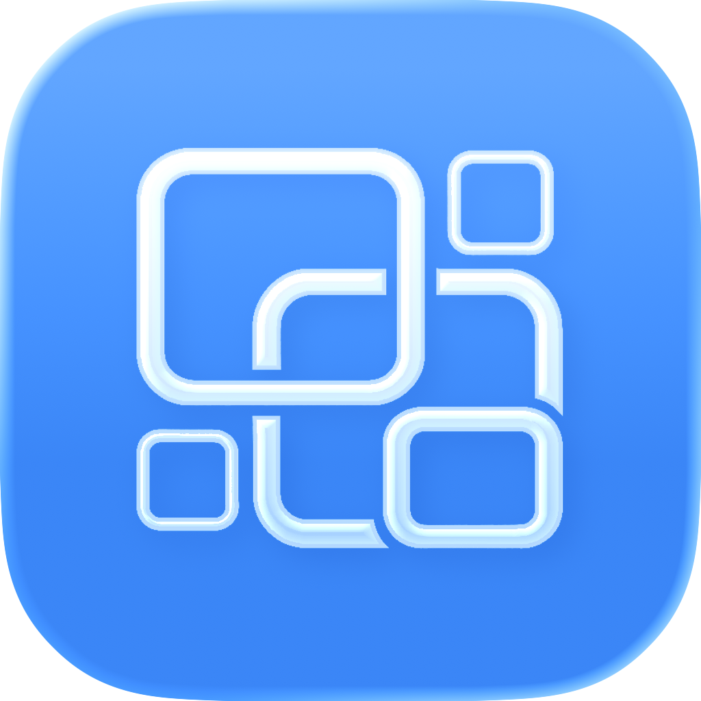

# wewi 🌐




**wewi** is a native macOS app that pins live web pages to your desktop as widgets.

Use it for dashboards, charts, docs, notes, and any URL you want to keep visible while working.

## ✨ Features

- Pin any URL as a desktop widget (`WKWebView`)
- Multiple widgets at once
- Widgets visible across Spaces
- Move and resize widgets directly on desktop
- Resize handle with concentric-circle indicator (hover to show, auto-hide delay)
- Widget body background fill behind web content (prevents transparent gaps on overscroll)
- System appearance sync signal to widget pages (`data-wewi-color-scheme` + change event)
- Per-widget settings:
  - Name, URL, position, size
  - Opacity
  - Auto-refresh interval
  - Enable/disable
  - Screen Lock mode (blocks web interaction)
- Widget top bar actions:
  - Save scroll position
  - Reload
  - Screen Lock toggle (`ON` = blocked, `OFF` = interactive)
  - Disable widget
- Menu bar controls:
  - Open Settings
  - Check for Updates
  - Manage Widgets opens the native Features page for enable/disable, reload and delete
- Auto-save widget settings (`UserDefaults` JSON)
- Restore each widget browser's saved scroll position after app relaunch
- Launch at login toggle in Settings

## 🧭 Usage

1. Launch `wewi.app`
2. Open **Settings** from menu bar
3. Select **Features**, then **Create New Widget**:
   - Enter Name + URL
   - Select size preset
   - Click **Add Widget**
4. Manage widgets below the creation form (URL edits apply with **Apply URL** or Return).

## 🚀 Build

### Prerequisites

- macOS 13+
- Xcode with the macOS 26 or newer SDK (deployment target remains macOS 13)
- MacAppEssentials checked out at `../tools/library`, including its `Integrations` directory

### Run (debug)

```bash
make app
open dist/wewi.app
```

### Build app bundle

```bash
make app
```

Built app path:

```text
dist/wewi.app
```

### Build DMG for distribution

```bash
# Optional: set Developer ID identity for trusted distribution
# export SIGN_IDENTITY="Developer ID Application: Your Name (TEAMID)"
#
# arm64
make dmg-arm64

# x86_64
make dmg-x86_64

# universal (arm64 + x86_64)
make dmg-universal

# both
make dmg-all
```

Generated DMG filenames:

```text
dist/wewi-1.0.2-arm64.dmg
dist/wewi-1.0.2-x86_64.dmg
dist/wewi-1.0.2-universal.dmg
```

Note:
- Default build uses ad-hoc signing (`SIGN_IDENTITY=-`) for local testing.
- For public distribution, use a valid `Developer ID Application` certificate and notarize the DMG/app. Without this, Gatekeeper may show "app is damaged" or block launch on other Macs.
- With ad-hoc distribution, users may need to remove quarantine manually:
  - `xattr -dr com.apple.quarantine /Applications/wewi.app`
  - `open /Applications/wewi.app`

### Sparkle Updates

wewi uses Sparkle 2 for automatic update checks.

The appcast URL embedded in the app bundle is:

```text
https://github.com/elixirevo/wewi/releases/latest/download/appcast.xml
```

Generate the Sparkle EdDSA key pair once:

```bash
make sparkle-keys
```

This stores the private key in your macOS Keychain and writes the public key to:

```text
sparkle-public-key.txt
```

Create a DMG and Sparkle appcast for a GitHub Release:

```bash
APP_VERSION=1.0.2 APP_BUILD=3 make appcast
```

For public distribution, sign and notarize the final DMG before generating the appcast signature. If you notarize/staple the DMG separately, reuse that final DMG:

```bash
APP_VERSION=1.0.2 APP_BUILD=3 SIGN_IDENTITY="Developer ID Application: Your Name (TEAMID)" make dmg-universal
# notarize and staple dist/wewi-1.0.2-universal.dmg
APP_VERSION=1.0.2 SKIP_DMG_BUILD=1 make appcast
```

Upload both generated files to the matching GitHub Release tag, e.g. `v1.0.2`:

```text
dist/wewi-1.0.2-universal.dmg
dist/appcast/appcast.xml
```

Useful overrides:

```bash
SPARKLE_FEED_URL=https://example.com/appcast.xml make app
GITHUB_REPOSITORY=elixirevo/wewi RELEASE_TAG=v1.0.2 make appcast
SIGN_IDENTITY="Developer ID Application: Your Name (TEAMID)" make appcast
```

## 🍺 Homebrew Install

Published casks are distributed via the shared tap repository:

- Tap repo: `https://github.com/elixirevo/homebrew-tap`
- Cask token: `wewi`

Install:

```bash
brew tap elixirevo/tap
brew install --cask elixirevo/tap/wewi
```

Local cask test from this repository:

```bash
brew install --cask ./Casks/wewi.rb
```

For maintainers:

1. Create/update release assets on `elixirevo/wewi`.
2. Copy `Casks/wewi.rb` into `elixirevo/homebrew-tap` (`Casks/wewi.rb`).
3. Commit and push the tap update.

## Shared app essentials

Settings, login items, app/status menus, accessory lifecycle, onboarding and versioned
Terms acceptance use the local MacAppEssentials package. Widget configuration and
WebKit panels remain app-owned. The original `wewi.widgets.v1` data is preserved.
The menu's **Manage Widgets…** command opens the Features page. General includes
language, appearance, login startup and optional diagnostics. Help & Support includes
onboarding replay, bundled legal documents, licenses and manual diagnostic export.

The first run explains creation, positioning, resizing, scroll restoration, refresh
and interaction locking, followed by privacy information, explicit Terms agreement
and optional crash reporting. Incomplete setup can be reopened. Updated Terms use
an independent agreement window. No widget networking or service startup occurs
before required acceptance. Restoring defaults only resets appearance.

### Privacy and crash reporting

Widget settings remain local; chosen websites receive browser requests and may
persist shared WebKit cookies. Sparkle contacts GitHub Releases for updates.
Sentry Cocoa 9.30.0 is connected through MacAppDiagnosticsSentry to project `wewi`.
Crash reporting defaults OFF, requires a separate choice and applies on the next
launch. The public DSN is bundled; management credentials are never bundled.
The current Sentry organization is on Trial with 90-day error retention (verified
2026-10-05); recheck before the trial ends or the plan changes.
The integration disables usage/session/performance tracking and replay, removes
user/request fields, and enables project IP/sensitive-data scrubbing.

Read the complete English/Korean Terms and Privacy Policy in
`Sources/wewi/Resources/{en,ko}.lproj/`. Operator/contact: elixirevo /
elixirevo@gmail.com. These documents adapt the library templates to this app;
no public legal-document URL is invented. Release owners must confirm applicable
operator disclosures and actual service retention/transfer obligations before publishing.

### Verification and screenshots

```sh
DEVELOPER_DIR=/Applications/Xcode.app/Contents/Developer swift test
make app
open -n dist/wewi.app --args --preview --page features -AppleLanguages '(ko)'
open -n dist/wewi.app --args --preview -AppleLanguages '(en)'
```

`--preview` isolates preferences in a disposable domain and never starts live widgets,
login registration, update requests or Sentry. Quit preview instances after testing.
Use `--page general`, `features`, `updates`, `support` or `about` to inspect settings.
The onboarding images are actual captures of the app's Features page, with sample
URLs and no personal data. The packaged executable includes all module resources and
Sentry's privacy manifest. dSYM output is retained beside the app in `dist/`; release
CI must upload the matching symbols to Sentry with credentials supplied outside the app.
Project provisioning/build success does not verify real crash delivery; an authorized
crash-and-relaunch test and symbolication check are still separate release validation.

## 🛠 Contributing

Contributions are welcome.
Please open an issue first for larger changes.

## 📄 License

Original wewi source: MIT, see `LICENSE`. MacAppEssentials and its integration
adapters: GPL-3.0-only. The combined distribution must satisfy GPL-3.0-only,
including provision of corresponding source for wewi and the exact library version
used. Sparkle and Sentry retain their own licenses. Bundled notices are in
`Sources/wewi/Resources/ThirdPartyNotices.txt`. This integration was verified against
MacAppEssentials 0.5.1, revision `b3e36a462ea6da4ba3d3272c08526765d9aca3c0`.
